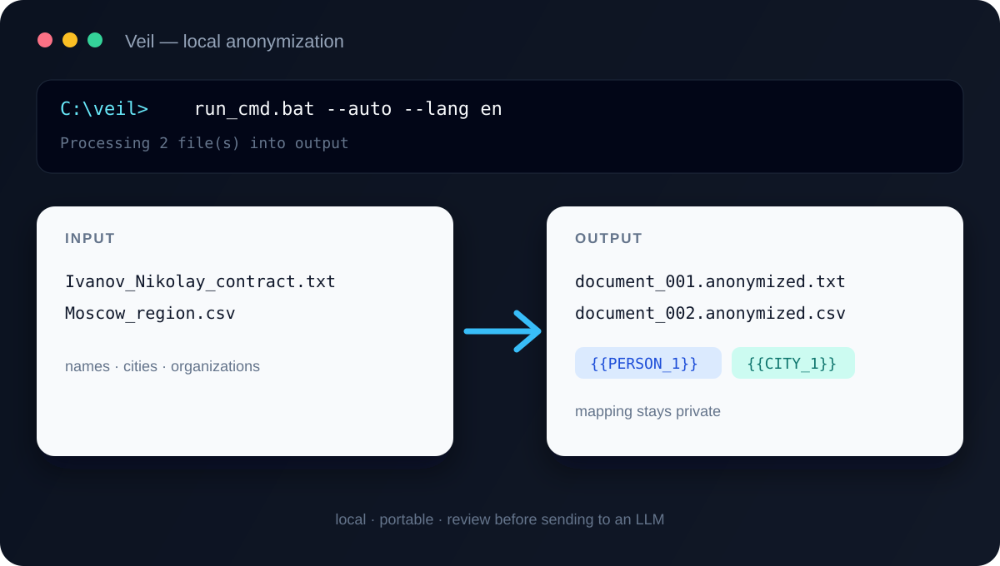

# Veil

<p align="center">
  
</p>

<p align="center"><strong>Local. Portable. Cautious by default.</strong></p>

Lightweight, local, interactive document anonymizer for Windows, Linux, and macOS. Veil replaces names, surnames, organizations, locations, addresses, contacts, and other PII before a document is sent to an LLM or another external service.

There is no GUI, cloud service, Node.js, or local LLM. The core is Python; the default workflow is a folder and one launcher command.



## Windows: fastest use with the portable release

1. Download `Veil-windows-x64.zip` from the [latest GitHub Release](https://github.com/KaigorodovTuskul/veil/releases/latest).
2. Extract it to a local folder.
3. Put source files into `input`.
4. Run `run_cmd.bat`.
5. Review files in `output` before sharing them.

The target Windows machine does not need Python or modified system environment variables.

## Linux and macOS: run from source

Requirements: Python 3.12 or newer. No system-wide installation is required.

```bash
git clone https://github.com/KaigorodovTuskul/veil.git
cd veil
python3 -m venv .venv
./.venv/bin/python -m pip install -r requirements.txt
./.venv/bin/python anonymize.py --self-test
```

Put documents into `input`, then run either interactive or automatic mode:

```bash
./.venv/bin/python anonymize.py --lang en
./.venv/bin/python anonymize.py --auto --lang en
```

If `uv` is already installed, the shorter setup is:

```bash
uv sync --locked
uv run python anonymize.py --self-test
uv run python anonymize.py --auto --lang en
```

The same Python commands work on Windows when a portable EXE is not used. On Linux and macOS, the repository currently provides source-based execution rather than a prebuilt archive.

## Interface languages

The default language is Russian. One build supports all available languages:

| Code | Language | Example |
| --- | --- | --- |
| `ru` | Russian | `--lang ru` |
| `en` | English | `--lang en` |
| `zh` | Simplified Chinese | `--lang zh` |

Windows batch launcher:

```powershell
run_cmd.bat --lang en
run_cmd.bat --lang zh
```

Linux/macOS:

```bash
./.venv/bin/python anonymize.py --lang zh
```

You can also set `VEIL_LANG=ru`, `VEIL_LANG=en`, or `VEIL_LANG=zh`. An explicit `--lang` value takes priority.

For unattended replacement, use auto mode on any platform:

```powershell
# Windows
run_cmd.bat --auto --lang en

# Linux/macOS
./.venv/bin/python anonymize.py --auto --lang en
```

Auto mode replaces every detected value and does not ask per candidate. Review the result manually before external use.

## Input and output

Supported input formats:

- TXT, JSON, CSV
- DOCX
- legacy DOC
- RTF
- text-based PDF

PPTX and OCR are not included yet. Image-only PDF pages are reported as unsafe/incomplete and are not silently treated as clean text.

Output filenames are deliberately neutral because sensitive information may be present in the source filename:

```text
input\Ivanov_Nikolay_contract.txt
output\document_001.anonymized.txt
output\document_001.txt.mapping.json
```

The original filename is stored only in the private mapping file. It is never copied to the output filename.

DOC, DOCX, and PDF are currently extracted to plain text. RTF keeps its RTF structure and formatting while replacing text; embedded RTF pictures and drawing objects are removed from the anonymized copy. The program prints warnings when a file contains unsupported or potentially unsafe content.

## Interactive review

For each detected value, choose:

```text
1 - replace this occurrence
2 - skip this occurrence
3 - replace all occurrences of this value
4 - stop without modifying the source
```

Repeated values receive the same placeholder, such as `{{PERSON_1}}` or `{{EMAIL_1}}`.

Rules are editable in [`patterns.json`](patterns.json). Detection is heuristic and best-effort: always inspect the anonymized document manually before sending it outside the machine.

## Restore an anonymized text file

Every processed file gets a mapping file containing the original sensitive values. Keep it private and never send it to an LLM.

```powershell
anonymizer.exe --restore output\document_001.anonymized.txt output\document_001.txt.mapping.json
```

The restored file is written next to the anonymized file with a `.restored` suffix. Restoration is intended for text-compatible output; it does not recreate original DOC/DOCX/PDF formatting.

## Build the Windows portable ZIP

Requirements on the build machine: Windows, Python 3.12+, and either `uv` or standard `venv`/`pip`.

### Recommended: uv

```powershell
uv sync --locked
uv run python anonymize.py --self-test
.\build_portable.ps1
Compress-Archive -Path dist\anonymizer\* -DestinationPath dist\Veil-windows-x64.zip -Force
```

The resulting archive is `dist\Veil-windows-x64.zip`. It contains a self-contained one-folder application with `anonymizer.exe`, `patterns.json`, and `run_cmd.bat`.

Linux and macOS portable builds are not published yet. They can run directly from the virtual environment described above.

### Fallback: standard Python

```powershell
python -m venv .venv
.\.venv\Scripts\python.exe -m pip install -r requirements.txt
.\.venv\Scripts\python.exe anonymize.py --self-test
powershell -NoProfile -ExecutionPolicy Bypass -File .\build_portable.ps1
Compress-Archive -Path dist\anonymizer\* -DestinationPath dist\Veil-windows-x64.zip -Force
```

## Development checks on any platform

```powershell
uv sync --locked
uv run python anonymize.py --self-test
uv run python -m py_compile anonymize.py extractors.py i18n.py
git diff --check
```

If `uv` is unavailable, use the Python executable from `.venv` instead. The repository's CI currently validates the Windows build; Linux/macOS source execution should be checked locally on the target platform.

## Repository layout

```text
anonymize.py          cross-platform CLI, auto mode, and restore mode
extractors.py         TXT/JSON/CSV/DOC/DOCX/RTF/PDF extraction
i18n.py               Russian, English, and Simplified Chinese UI
patterns.json         configurable detection rules
run_cmd.bat           folder-mode launcher
build_portable.ps1    PyInstaller one-folder build
input/                local source files; ignored by Git
output/               local results and mappings; ignored by Git
```

## Security notes

- Mapping files contain the original values and are equivalent to sensitive data.
- Do not commit real documents, output files, mapping files, or personal data.
- A successful run is not proof that every PII value was found.
- Review every anonymized file and the console warnings before external use.

See [`SECURITY.md`](SECURITY.md), [`CONTRIBUTING.md`](CONTRIBUTING.md), and [`CHANGELOG.md`](CHANGELOG.md).

## License

No license has been selected yet. Add the license that matches the intended use before treating the repository as a distributable open-source project.
